## **Mixify - Cocktail Sharing Website**

### Milestone Project 3 - Backend Development

* Mixify is a web application designed to help users create and share personalized cocktail recipes with friends and cocktail enthusiasts. This platform provides a user-friendly interface for discovering new cocktails, experimenting with ingredients, and sharing your creations with others. Whether you're a seasoned mixologist or a novice bartender, Mixify makes it easy to explore the world of cocktails and elevate your home bar experience.
* This website has been designed using Python, ElephantSQL & PostgreSQL Javascript, HTML, CSS and Materialise CSS. It is my submission for Code Institute's Level 5 Diploma in Web Application Development Milestone Project 3.

## Live Project

[View the live project here](https://mixify-229d068bcc7b.herokuapp.com/)

## Contents

- [**User Experience**](#--user-experience--)
  * [Background](#background)
  * [Site Owners Goals](#site-owners-goals)
  * [First Time User Goals](#first-time-user-goals)
  * [Frequent User Goals](#frequent-user-goals)
  * [Features To Be Included](#features-to-be-included)
- [**Design**](#--design--)
  * [Colour Pallete](#colour-pallete)
  * [Typography](#typography)
  * [Images Used](#images-used)
  * [Icons](#icons)
- [**Structure**](#--structure--)
- [**Wireframes**](#--wireframes--)
  * [Website Layout](#website-layout)
   * [Base.html page:](#basehtml-page)
   * [Landing page (index.html):](#landing-page--indexhtml)
   * [Signup page:](#signup-page)
   * [Login page:](#login-page)
   * [All Recipes Page:](#all-recipes-page)
   * [My Recipes Page:](#my-recipes-page)
   * [Add Recipe Page:](#add-recipe-page)
   * [Edit Recipe Page:](#edit-recipe-page)
   * [View recipe page:](#view-recipe-page)
   * [My Favourites page:](#my-favourites-page)
- [**Features**](#features)
   * [Under 18 sign up prevention.](#under-18-sign-up-prevention)
   * [User alert messages.](#user-alert-messages)

# **User Experience**

## Background

* Mixify was created to bring cocktail enthusiasts together in a vibrant community where they can discover, share, and create unique cocktail recipes. With a passion for mixology and a commitment to fostering creativity and collaboration, Mixify has been built to be a go-to destination for cocktail lovers of all levels. Join now and explore the world of cocktails like never before!

## Site Owners Goals

* To provide a platform for users to create an account and log in.
* Restric the website to users who are 18 or over only.
* Allow users to share cocktails with fellow members.
* Allow users to view different recipes.
* Allow users to add recipes to their favourites.

## First Time User Goals

* Navigate the site with ease.
* Create a Profile: Sign up for an account and be able to log in to access the site.
* View all cocktails which have been submitted to the website.
* Add cocktails they like to their favourites.
* Submit new recipes.

## Frequent User Goals

* Log in to their account they have created.
* View reicpes that they have added to favourites previously.
* View recipes that they have submitted.
* Remove recipes from their favourites if desired.
* Edit the recipes they have previously submitted and continue to add new ones.
* Delete recipes they no longer wish to share.

## Features To Be Included

* Sign up page for users to join.
* Log in page for users to sign in.
* Showcase an all recipes page showing preview cards.
* Showcase a my recipes page showing preview cards.
* Showcase a favourite recipes page showing preview cards.
* Allow users to view recipes by clicking on the preview cards to show the full recipe.
* Allow users to submit new recipes.
* Allow users to edit recipes that only they have submitted.
* Allow users to delete recipes that only they have submitted.
* Quick access links to external sites in the footer.
* 404 page for invalid content with a report a problem form to inform the site owner.

# **Design**

## Colour Pallete

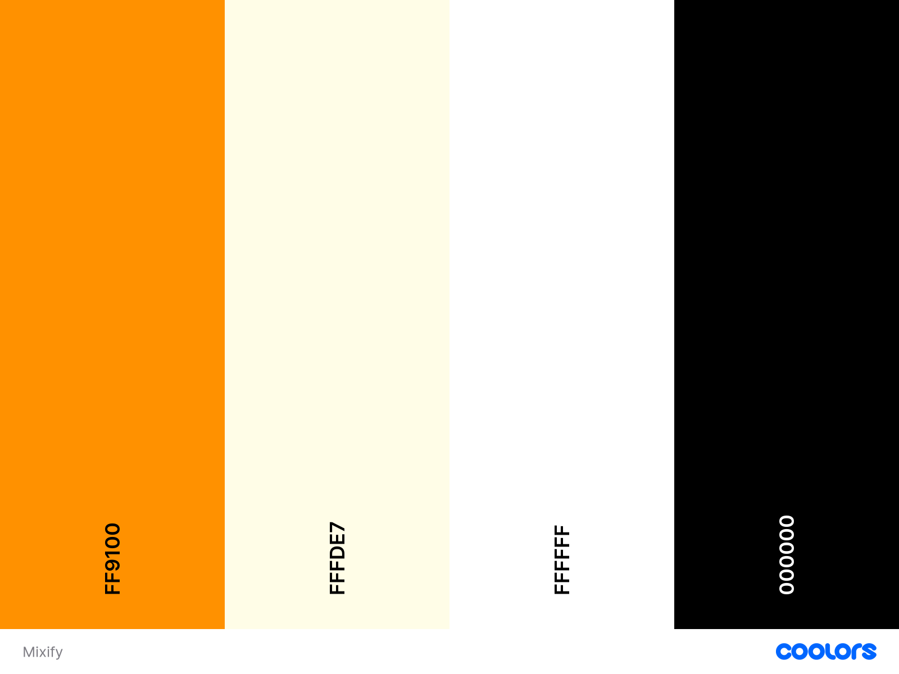

[Pallette Created Using Coolors.co](https://coolors.co/)

* The reason I have went with the above colour scheme is because I thought that it imitated the colours of a cocktail. The background of the site is orange that has a vertical gradient into. I went with a black font on my navigation bar and majority of the site as it contrasted well with the orange and yellow. From the middle toward the bottom of the site for example the get started button and the footer I used black boxes with the light yellow for text and icons. This blended in perfectly with the background but still kept full readability.

## Typography

I have chosen the Outfit Font. This is provided by Google Fonts and [can be found here.](https://fonts.google.com/specimen/Outfit)

I have used the regular font weight for standard text and chosen a weight of 600 when adding emphasis such as on the heading and title text.

I have selected sans-serif to be the default font if Firs Sans can not be loaded.

## Images Used

* I have only used one image throghout my whole site which is on the index.html landing page. I have used a cocktail glass outline from [VectorStock](https://www.vectorstock.com/royalty-free-vector/one-line-continuous-cocktail-wine-glass-symbol-vector-45757694) I used photoshop to alter the image. I stretched the line at the bottom of the glass to fill a 1920 x 1080 desktop screen and added the gradient background colours.

* To keep the website simple on medium and smaller devices the background resizes and only the underline is visible. So text is always clear and readable.

* I intend the add the facility to allow users to submit photos of their drinks in later releases of the site.

## Icons

I have used fontawesome icons for the external link icons where are present in the footer.

# **Structure**

# **Wireframes**

Here are all of the wireframes designed for this page broken down into device level. I desgined these wireframes with mobile first in mind and due to the nature of the site and the size of the content there was no changes needed to be made in terms of content displayed so I have combined my mobile and tablet wireframes into one.

* Homepage

* Signup Page

* Login Page

* All Recipes Page

* My Recipes Page

* Favourite Recipes Page

* Add Recipes Page

* View Recipes Page

* Edit Recipes Page

* 404 Page

## Website Layout

The website has been desinged using Python, ElephantSQL & PostgreSQL Javascript, HTML, CSS and Materialise CSS. It has been desinged using a mobile first approach.
The website has a landing homepage that details the main purpose of the site and has a promintent get started button which takes the user to the signup page.
There is also a navbar and footer which is present on all pages.

### Base.html page:
Although this page is not shown to the user it is one of the most important pages of my site when it comes to the deisgn. This is where the navbar has been designed and also the footer. This is also where all of the scripts are loaded on the site and the extra CSS outside of materialise. The navbar is designed to display certain links depending if the user is logged in or not. This is also where the flashed message alerts for the user are stored for use.

### Landing page (index.html):
This is the page the user is shown upon first time access to the website. The Navbar is present at the top and also there is a title of the page with a small sentence detailing the site purpose, with a get started button which directs the user to the Signup Page if the user is not logged in and directs them to the my recipes page if they are. Underneath the Get Started button there are 3 cards. Displayed in a grid format which changes depending on what device it is viewed on that highlights some of the sites main features - Which are Contribute, Discover and Favourite. The cards also have MaterialiseCSS icons in each. The footer is also present.

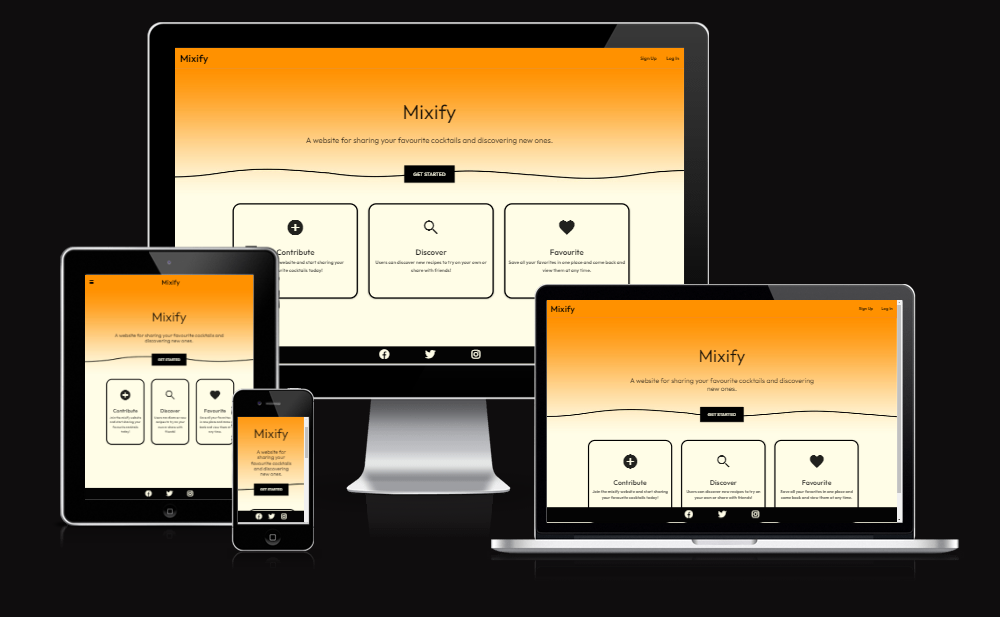

### Signup page: 
This is the page where the user will create an account it is a simple form that requires the user to enter the following information.
  * Username
  * First Name
  * Last Name
  * Date of Birth
  * Password

* All of the fields are requiured to be completed by the user to sign up and this has been re-iterated with a message saying "* Indicates required!" at the bottom of the signup page before the sign up button.
* The website also requires the user to be at least 18 or over to join the site and there is a Javascript function in place that checks this to prevent under 18s signing up.
* Once a user has signed up a message will flash stating "Signup complete - Thank you for joining Mixify!"

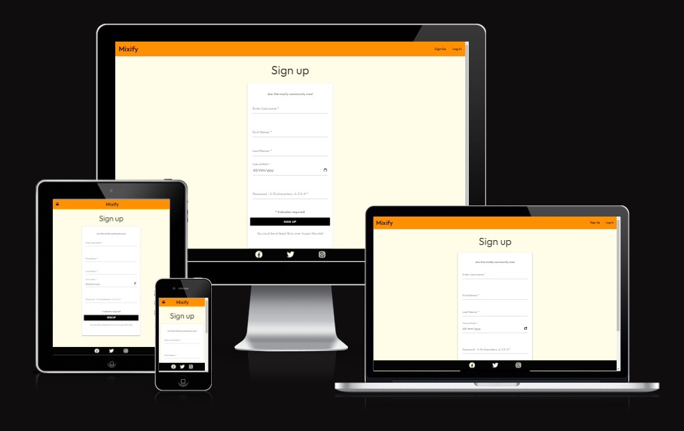

### Login page:
* This page is simple and contains little information. There is 2 input boxes. One for the username, the other for the password. There is an Enter button underneath that, if the correct information is input, the user will be logged in to thier account. There is also a message at the bottom saying "Not yet registered? Sign up here." which a link that will take them to the sign up page if they havent signed up yet. Once a user is logged into their account they will be directed to the All Recipes page and a message will flash up to the user stating "You are logged in as: (Username)" At this point, the navbar will also update to remove the signup and login links and now show the All Recipes, My Recipes, Add Recipe, My Favourite and Logout Links.

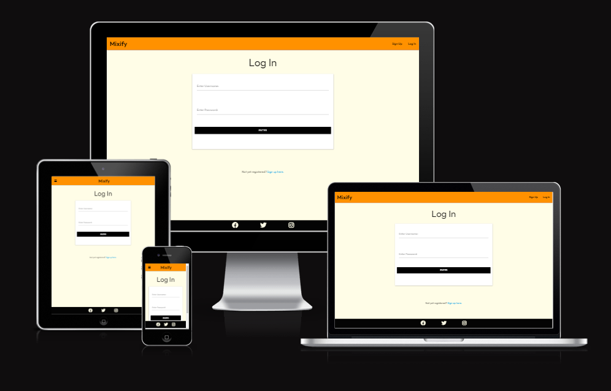

### All Recipes Page:
* This page shows the user previews of all the recipes that have been submitted in a card format. The user is shown the title of the recipe, a brief description and underneath a view icon which when clicks displays the full recipe to the user. I have chosen to only display a set character limit on the description to ensure all of the cards are the same size. I have also added a see more button at the end of the description if the user wants to click that button instead. The cards are responsive to the device being used at the time. For example there is 3 cards horizontally on desktop devices and 1 card shown horizontally on mobile devices.

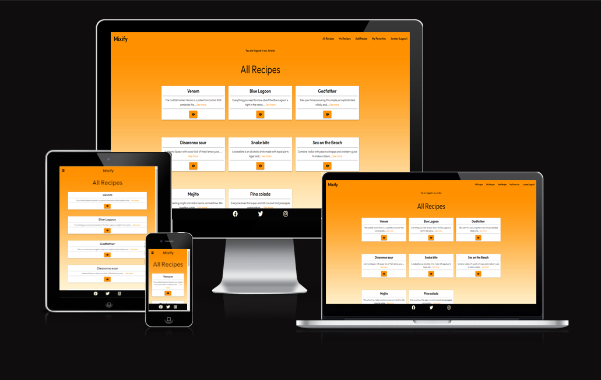

### My Recipes Page:
* This page shows the user previews of all the recipes that have been submitted by that user only in a card format. The user is shown the title of the recipe, a brief description and underneath the same as the all recipes page. However, the user is now shown 2 extra buttons, a edit button and a delete button. They will take the user to the edit recipe page and the delete recipe page. The page also displays all of the information to the user in the same way as the all recipes page to help with the consistency of the site.

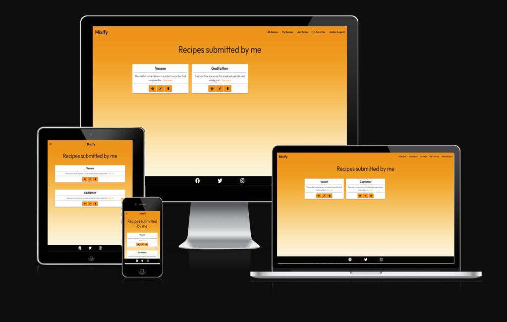

### Add Recipe Page:
* This page contains a form similiar to the sign up page. The form has 4 boxes for the user to submit information.
  * Recipe title
  * Recipe Description (A minimum of 70 characters is required.)
  * Recipe Ingredients
  * Recipe Instructions
 
* At the bottom of the form is the add recipe button. Once pressed the recipe will be stored to the database with all of the information completed. A recipe ID will be given and also the name of the user signed in will be stored so the My Recipes page will function correctly.

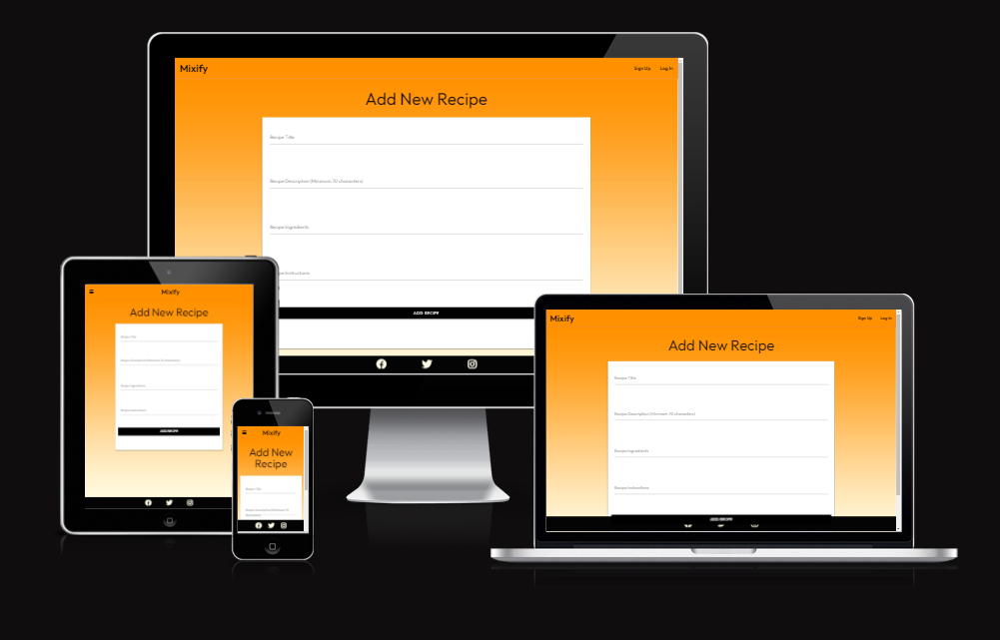

### Edit Recipe Page:
* This page contains the same form as the above Add Recipe page, however the website will only let you edit the recipe if the username of the current user matches that of the user that submitted the recipe.
* The form will already be pre-populated with all of the infomation that had been previously submiited so that the user will not have to re-enter any information, only edit what is needed at the time.

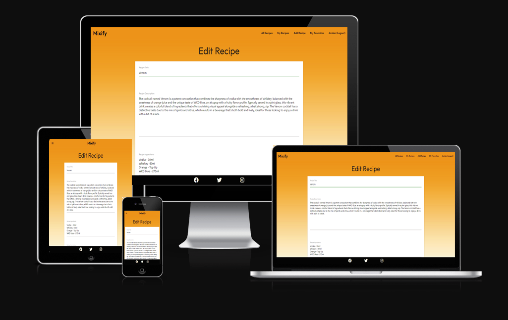

### View recipe page:
* The user can view the full recipe page by clicking on either the see more button on the recipe card or at the bottom of the card clicking on the view icon. These buttons are present on the following pages. All recipes, My recipes and Favourite recipes. When viewing the full recipe the user is shown the title of the recipe at the top of the page just below the nav bar and then a content box showing the following.

  * Full recipe description.
  * All of the ingredients needed.
  * Intructions on how to make.
  * Name of user who has submitted the recipe.
  * 4 buttons at the bottom. FAVOURITE, UNFAVOURITE, EDIT and DELETE

* All of the above buttons will allow the user to complete their respective functions. As previously mentioned, the edit button will only work if the current user matches the user who submitted the recipe.
* The delete button works slightly different as it works if the current user matches the user who submitted the recipe and also will work if the username is Admin. An account that I have created to remove any content that may be submitted which is not suitable.
* When the favourite button is pressed the user will be given the message "Recipe added to favorites successfully." the user will then be directed to the My Favourites page.

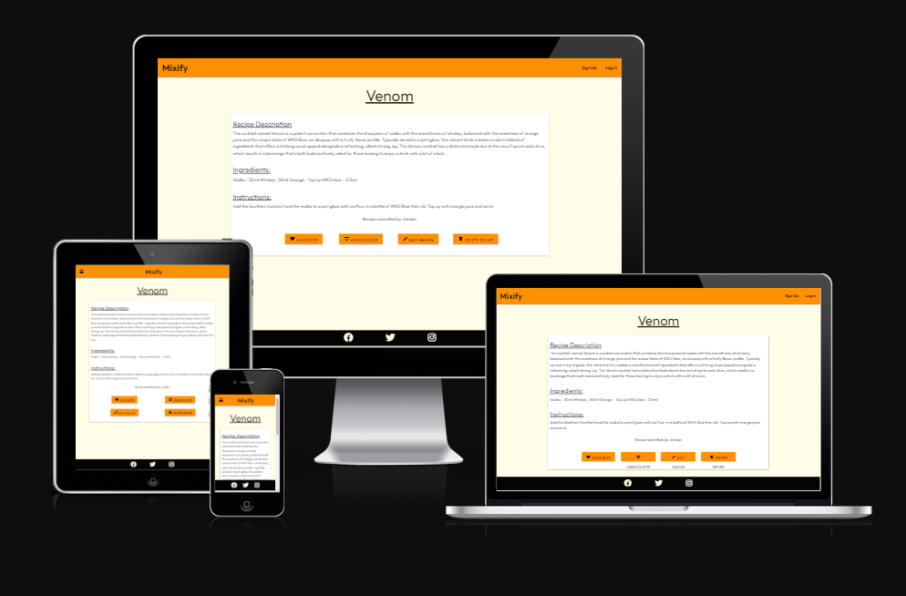

### My Favourites page:
* This user is almost a mirror image of the my recipes page. This page shows the user previews of all the recipes that have been favourited by that user only in a card format. Unlike the my recipes page, the user is only able to view the main recipe they are unable to see the buttons for edit and delete. If a user removes a recipe from their favourites it will no longer display on this page.

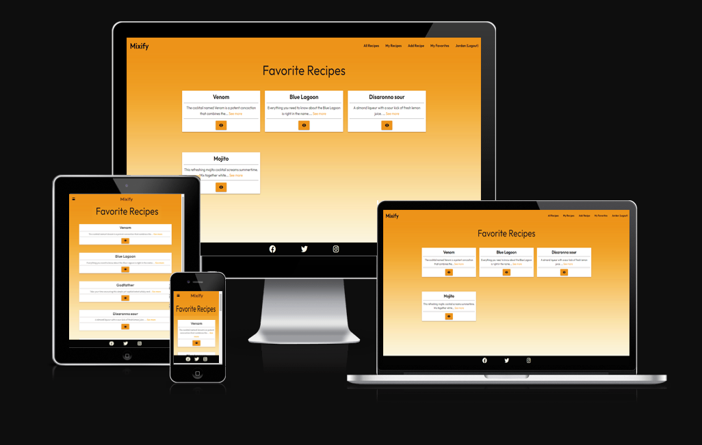

## Features

### Responsive Navbar

My Navbar has been desgined to be responsive in a number of ways. It responds to the device in which it is being used and also the options displayed to the user are different if they are logged in or out.

__Desktop logged out Nav bar__

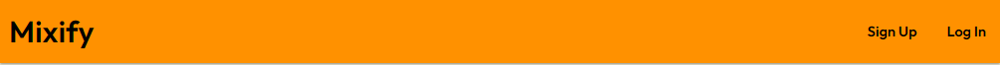

__Desktop logged in Nav bar__

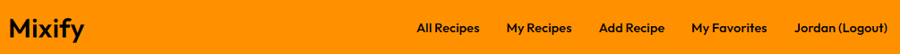

__Mobile Nav bar__

__Mobile Expanded Nav bar Signed Out__

__Mobile Expanded Nav bar Signed In__

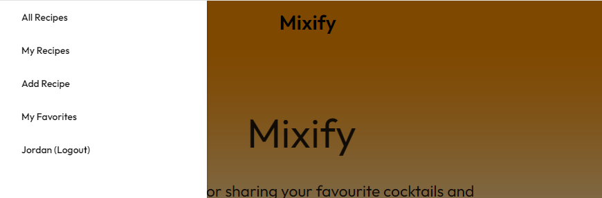

### Date of birth Verification.

* When a user completes the sign up form if they have input a date of birth that would make them under the age of 18 a Javascript alert will pop up stating "You must be 18 or older to sign up." They will be unable to create an account if the date of birth is not equal to or greater than 18 years old.

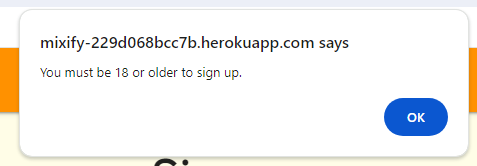

### Accidental deletion prevention.

* When a user attempts to delete a recipe they will recive a Javascript alert asking them if they are sure they want to delete. They can press cancel to stop or ok to continue.

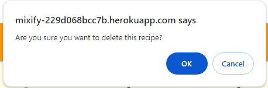

### User flash messages.

Users will be shown alerts on the top of the page below the nav bar when completing certain actions on the site. The alerts are as follows:

__If username is already in use alert user__

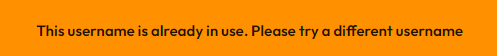
  
__When users signs up alert user__

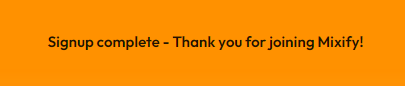

__When user signs in alert user__

__If recipe is edited alert user__

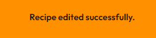

__If recipe is deleted alert user__

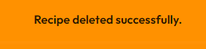

__If recipe is added to favourites alert user__

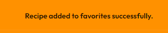

__If recipe is removed from favourites alert user__

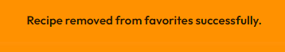

### Cards

Recipes are previewed to users in a materialise card. They take the user to the full recipe when clicked on.

__My Recipes Cards__

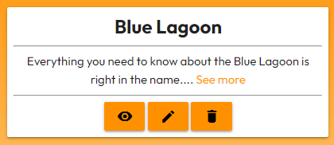

__Other Cards (All recipes, favourite recipes pages)__

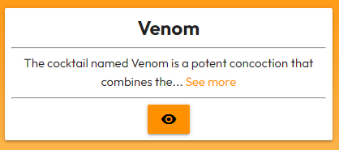

### Form Submissions

There is a number of forms that users will complete during their time browsing the site. They are as follows:

__Sign up form__

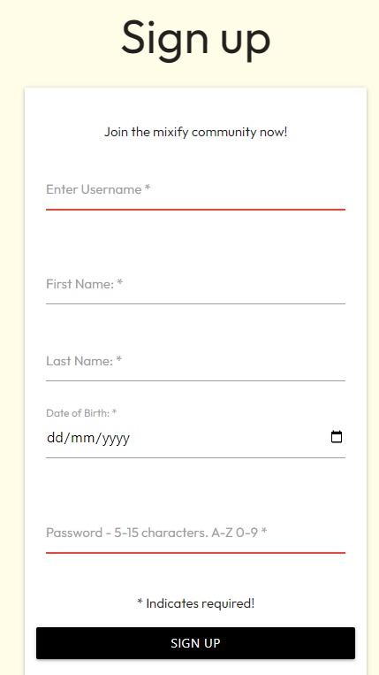

__Login form__

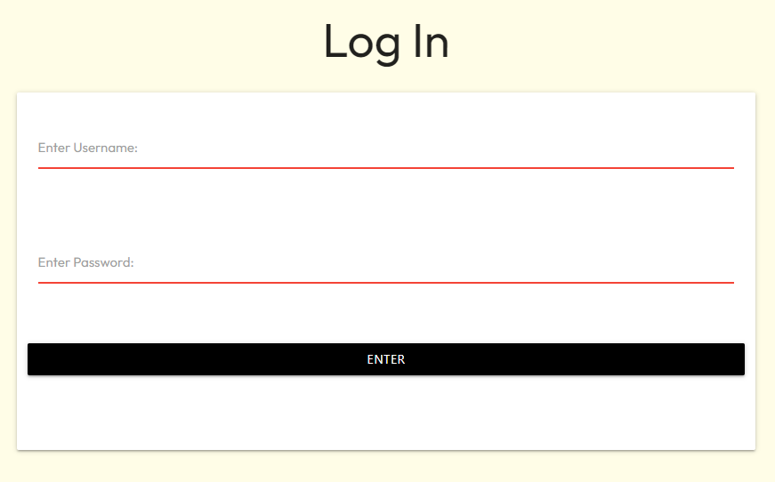

__Add recipe form__

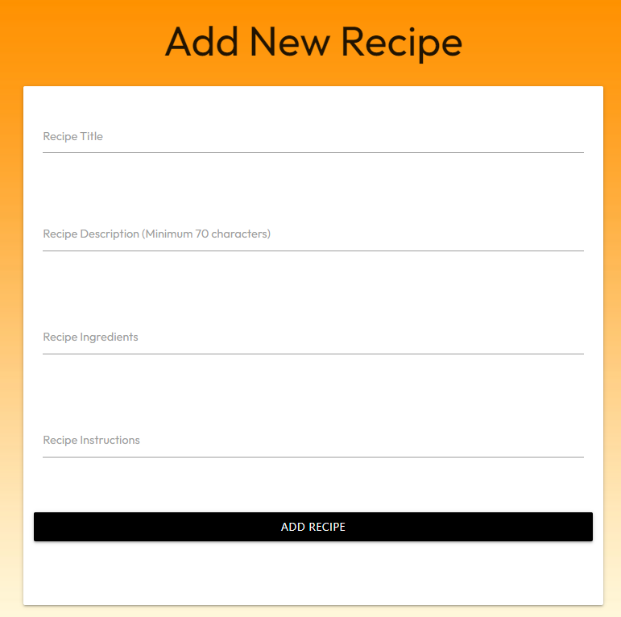

__Edit recipe form__

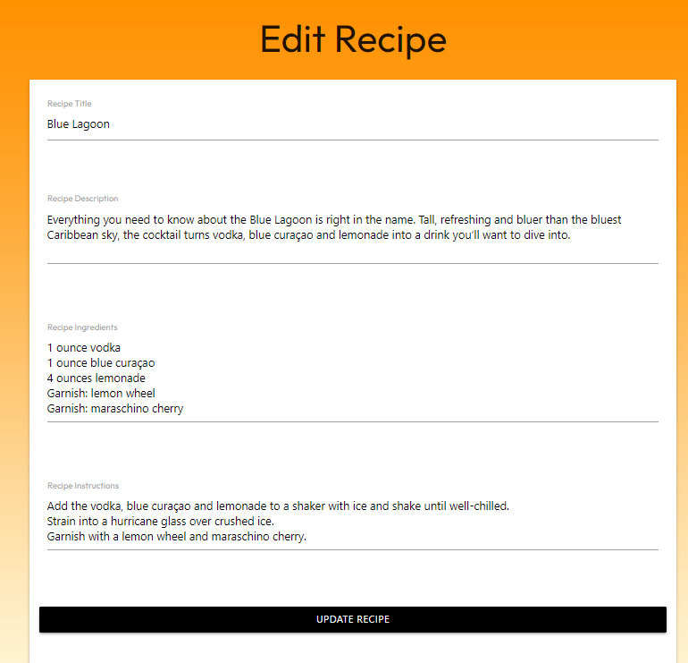

### View recipe page

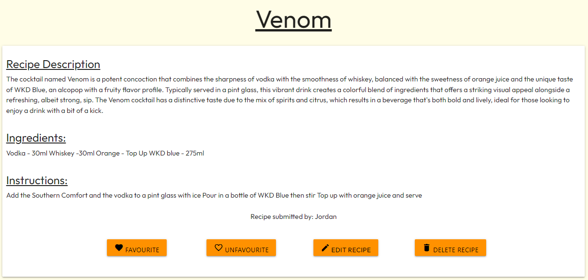

# **Design Justifications**

__Single Image on Homepage__

My whole site only contains 1 image and that is on the homepage. This is part of the background. I did not want to have different images of cocktails all over the website as thier would be a clash of colours.
Also, I only know at this time on how to add an image to a database via a URL and how to retrieve that URL. I decided that if users were to look for an image of a cocktails they would end up on another cocktail site to find one, potentially driving users away.

__Recipe Description Minimum Character Limit__

I believe users should give as much details as possible when adding a recipe to the site. I did not want users to be able to submit 1 word descriptions such as "Nice" or "Fruity"

__Restricted Editing__

I decided to only allow users to edit and delete thier own recipes. I feel that allowing only the creator to edit or delete their content enhances user privacy and security, and users feel more confident knowing that they have control over their own contributions and can manage them according to their preferences.

# **Functions Explained**

The following section will explain in detail how each function works.

[PlaceHolder]

# Data Model

[View my Database structure in PDF form here](mixify/images/database-schema.pdf)

# Deployment & Local Development

## Deployment

The Local Legends project was made live through GitHub. This is how to deploy:

1. Log in (or sign up) to GitHub.
2. Find the repository for this project, Jordan094/.
3. Click on the Settings link.
4. Click on the Pages link in the left-hand side navigation bar.
5. In the Source section, choose main from the drop-down select branch menu. Select Root from the drop-down select folder menu.
6. Click Save. Your live GitHub Pages site is now deployed at the URL shown.

## Local Development

### How to Fork

To fork the mixify repository:

1. Log in to your GitHub account or sign up if you don't have one.
2. Visit the repository at Jordan094/mixify.
3. Click the "Fork" button located at the top right corner.

### How to Clone

To clone the mixify repository:

1. Log in to your GitHub account or sign up if you don't have one..
2. Go to the repository for this project, Jordan094/mixify.
3. Click on the code button, select whether you would like to clone with HTTPS, SSH or GitHub CLI and copy the link shown.
4. Open the terminal in your code editor and change the current working directory to the location you want to use for the cloned directory.
5. Type 'git clone' into the terminal and then paste the link you copied in step 3. Press enter.

### How to deploy

The models.py file contains the database structure and tables. I have used Elephant SQL to store the database by doing the following:

#### Elephant SQL

1. Sign up to [Elephant SQL](https://www.elephantsql.com/)
2. Log in to your account
3. Click Create Instance, e.g. mixify
4. View the full Instance list and click into mixify
5. You will be shown a URL. Copy this URL for use in heroku

#### Heroku

1. Sign up to [Heroku](https://dashboard.heroku.com/)
2. Log in
3. Click New, then Create New App. Give the name of mixify
4. Click mixify
5. Click Settings
6. Click Reveal Config Bars
7. Input the following:
   *DATABASE_URL = Input the URL You copied from elephantSQL
   * DEBUG = True
   * IP = 0.0.0.0
   * PORT = 5000
   * SECRET_KEY = "Choose your own secret key"
   * KEY = VALUE

MAKE SURE YOU REMOVE DEBUG = TRUE BEFORE FINAL DEPLOYMENT
DO NOT SHARE YOUR SECRET KEY WITH ANYONE

8. Click Deploy
9. Select Manual Deployment, then Deploy.
10. Once complete. Select Run Console in the top right corner
11. Enter Python then click Run
12. Enter the following: "from mixify import app, db app.app_context().push() db.create_all()"
13. Type exit() and close the console
14. Scroll back to the bottom and click Deploy. The live Heroku project will then open in a new tab.

# **Accessibility**

I wanted to ensure that the website was fully accessible. I have done this by doing the following:

* Providing Alternative Text (Alt Text)
  * I've made sure to add descriptive alternative text (alt text) to all images on the website. Alt text adds context to images, enabling users who rely on screen readers to understand the visual content even if they can't see it.
* Ensuring Color Contrast
  * I've chosen color combinations that maintain accessible contrast ratios, ensuring that text remains readable against different background colors. This benefits users with visual impairments or color blindness.
* Responsive Design
  * The site is designed to adapt to various devices and screen sizes. This caters to users who rely on different devices or have specific accessibility requirements.

# Testing

[PlaceHolder]

# User Feedback

After I deployed my website I sent it to a number of peers to test and provide me with feedback. Here is a number of changes that I have made due to user feedback.

* On the signup page it was suggested to let the user know that the fields are required. Changes have been made based on this feedback.

* On the signup page it was suggest to let the user know what is required when entering a password e.g. Minimum of 8 characters. Changes have been made based on this feedback.

* On the footer page the links were not re-driecting the user to the intended site. This has now been fixed.

# **Future Developments**

There are a number of features I would like to add in the future to my website, the features are as follows:

* I want to allow users to submit their own image files.
* I want to allow users to rate other peoples cocktails out of 10.
* I want to allow users to comment on submitted recipes.
* I want to allow users to suggest edits.

# **Technologies Used**

* [HTML5](https://www.w3schools.com/html/html_intro.asp)
  * HTML was used to create my website
* [Python](https://www.python.org/)
  * Used for my websites core functionality
* [Heroku](https://id.heroku.com/login)
  * Heroku is the deployment source I used for this project.
* [Flask](https://flask.palletsprojects.com/en/2.2.x/)
  * Templating Language
* [MaterialiseCSS](https://materializecss.com/)
  * UI component library that is created with HTML, CSS, and Javascript
* [ElephantSQL](https://www.elephantsql.com/)
  * ElephantSQL installs and manages PostgreSQL databases
* [CSS3](https://www.w3schools.com/css/css_intro.asp)
  * CSS was used to style my website
* [Javascript](https://en.wikipedia.org/wiki/JavaScript)
  * Javascript was used to add functionality to my website
* [GitHub](https://github.com/)
  * I used github to create my repository and store my projects code.
* [Code Anywhere](https://app.codeanywhere.com/)
  * I used Code Anywhere as my IDE
* [Chrome](https://www.google.com/intl/en_uk/chrome/)
  * I tested my website and responsiveness throught creation using chrome developer tools.
* [Balsamiq](https://balsamiq.com/)
  * Balsamiq was used to create the wireframes during the design process.
* [Google Fonts](https://fonts.google.com/)
  * I used the font Outfit which is a Google font, with a fallback font of Sans-Serif thoughout my whole project.
* [Am I Responsive?](https://ui.dev/amiresponsive)
  * This was used to test the responsiveness on all devices once the pages were complete.
* [W3 Schools HTML Validation Service](https://validator.w3.org/)
  * This was used to check for any HTML errors in the code.
* [W3 Schools CSS Validation Service](https://jigsaw.w3.org/css-validator/)
  * This was used to check for any HTML errors in the code.

## Validation and Tools

[Placeholder]

# Acknowledgements

* Thank you to [Code Institute](https://codeinstitute.net/) staff for providing me lessons.
  
* Thank you to [City of Bristol College](https://www.cityofbristol.ac.uk/) for facilitating my learning.

* Thank you to Pasquale Fasulo for my tutoring sessions and [Manuel Perez Romero](https://github.com/Manuperezro) for my one to one sessions.

* Thank you to Thomas Farrell for providing invaluable in depth user testing feedback as a qualified software tester.

* Thank you to [Daniel Matthews](https://github.com/Dan-Matthews-23) for support offered and also for testing.

* Thank you to Levi Webb for providing android testing and laptop testing.
